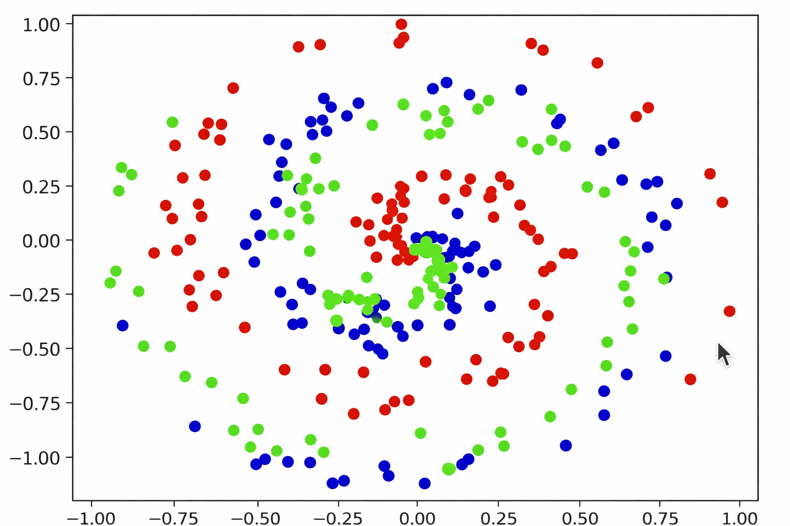

# Spiral Classification Neural Network (From Scratch)

A simple neural network implemented completely from scratch using **NumPy** to solve the classic **spiral dataset classification** problem.

This project manually builds the core components of a neural network — without using frameworks like TensorFlow or PyTorch — to help you understand how neural networks work under the hood.

## Features

- Dense (Fully Connected) layers
- ReLU activation function
- Softmax output for multi-class probability
- Categorical Cross-Entropy loss calculation
- Forward propagation implemented with NumPy

This project uses:

- **Python**
- **NumPy**
- **nnfs** (for generating the spiral dataset)

## Get Started

Clone the repository:

```bash
git clone https://github.com/yashdeep7733/Spiral-classification-neural-network-3.13.3.git
cd Spiral-classification-neural-network-3.13.3
pip install -r requirements.txt
python spiral-neural-network.py
```

<p align="center">
  
</p>
